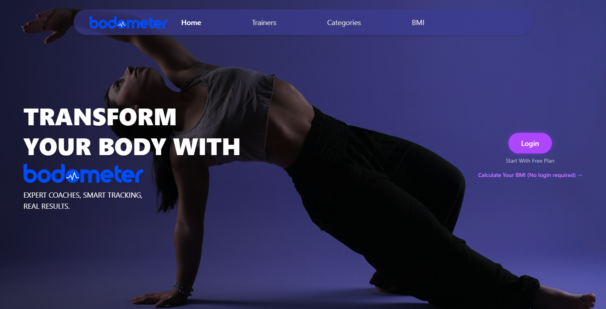
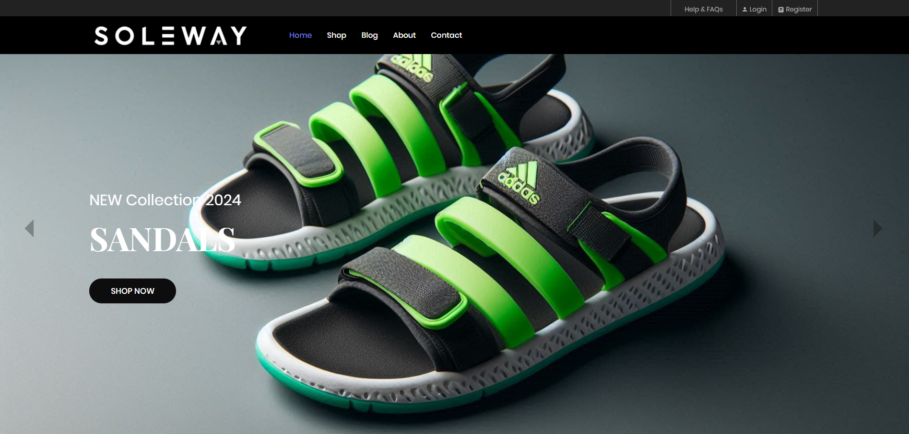
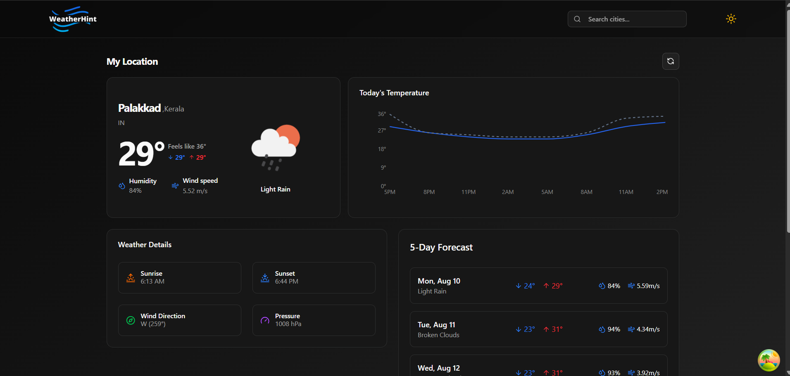

<h1 align="center">Hi there , I'm Akhildas - H</h1>

MERN Stack Developer focused on clean architecture, backend-first systems, and modern full-stack experiences.

  

Developer mode — building, debugging, shipping.

  
  
 

## About Me

I'm a **MERN Stack Developer** focused on building scalable,
production-oriented web applications with **TypeScript, React,
Node.js, Express.js, and MongoDB**.

I enjoy designing **REST APIs**, implementing secure authentication,
and structuring backend applications using **SOLID principles,
Repository Pattern, and clean architecture**.

Currently, I'm building **Bodometer**, a full-stack fitness platform
with user, trainer, and admin workflows.

  
---

## Technical Skills

### Languages

### Frontend

### Backend

### Database

### Cloud & DevOps

### Tools

## Featured Projects

<table>
  <tr>
    <td width="45%" valign="top">
      
<strong>Bodometer</strong> <em>Fitness &amp; lifestyle platform</em>

      <ul>
        <li>Tracks workouts, nutrition, sleep and daily activities</li>
        <li>Connects users with trainers</li>
        <li>Built with MERN, TypeScript, Redux Toolkit, Tailwind CSS</li>
      </ul>
      

        <!-- <a href="YOUR_BODOMETER_LIVE_URL">Live Demo</a> · -->
        <a href="https://github.com/akhildas675/bodometer-frontend.git">Frontend Repo</a> · <a href="https://github.com/akhildas675/bodometer-backend.git">Backend Repo</a>

    </td>
    <td width="55%" valign="top">
      
    </td>
  </tr>
</table>

<table>
  <tr>
    <td width="45%" valign="top">
      
<strong>SoleWay</strong> <em>Full-stack shoe e-commerce application</em>

      <ul>
        <li>Authentication, cart, coupons, wallet and online payments</li>
        <li>Admin dashboard for product and order management</li>
        <li>Built with Node.js, Express.js, MongoDB, EJS</li>
      </ul>
      

        <!-- <a href="YOUR_SOLEWAY_LIVE_URL">Live Demo</a> · -->
        <a href="https://github.com/akhildas675/soleway-ecommerce.git">Repository</a>

    </td>
    <td width="55%" valign="top">
      
    </td>
  </tr>
</table>

<table>
  <tr>
    <td width="45%" valign="top">
      
<strong>WeatherHint</strong> <em>Full-stack weather app</em>

      <ul>
        <li>Searches weather, hourly forecasts, and favorites</li>
        <li>Built with React, TypeScript, Vite, TanStack Query, Tailwind CSS, Recharts</li>
      </ul>
      

        <!-- <a href="YOUR_WEATHERHINT_LIVE_URL">Live Demo</a>  -->
        · <a href="https://github.com/akhildas675/weatherhint-frontend.git">Repository</a>

    </td>
    <td width="55%" valign="top">
      
    </td>
  </tr>
</table>

---

## Contribution Activity

  

    
   
  

  

---

## Currently Learning

- Advanced TypeScript
- Data Structures & Algorithms
- System Design
- Clean Architecture
- Database Optimization
- AWS

---

## Connect

- GitHub: [akhildas675](https://github.com/akhildas675)
- LinkedIn: [Linkedin](https://www.linkedin.com/in/akhildas675/)

